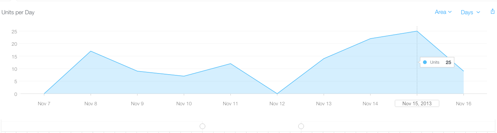
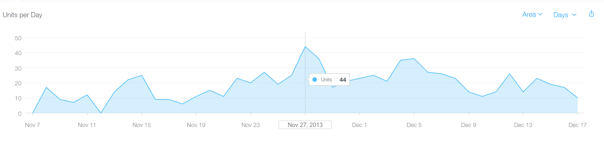
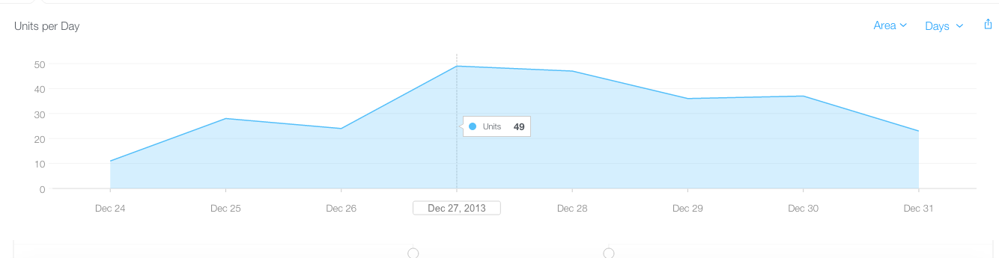
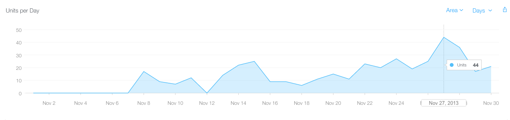
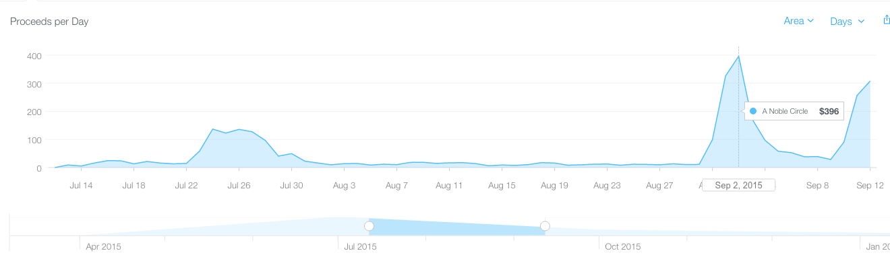
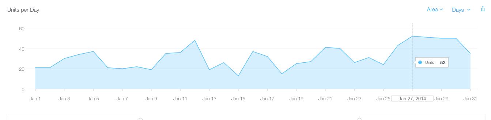
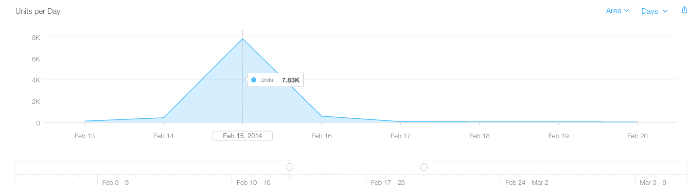
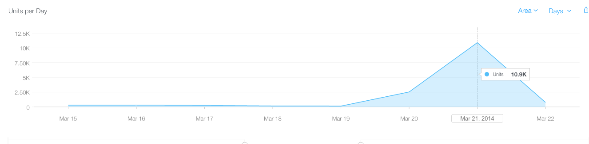

# Marketing A Dark Room

At this point, the major brunt of development is complete for A Dark
Room is complete. Approximately six months earlier, the web version of
ADR went viral. Twitter was filled with people references the website
url. I used that as a starting point for my marketing efforts. And
built from there.

## Day 159 - Nov 10, 2013: My Obsession with Twitter and @ADarkRoomiOS Begins ##

I created the @ADarkRoomiOS Twitter handle and started tweeting in the
persona of the game. The plan was to interact with anyone and everyone
who ever tweeted about the web version of the game. Having a daily
tweet from the game, showed that I wasn't just a random spam
bot... that there was a real person behind these tweets. I did a
Twitter search for "adarkroom" and began combing through all the
tweets... replying to anyone who mentioned the game. Letting them know
that there was an iOS version.

**Postmortem**

I'd say at a minimum, have a website for your game and a Twitter
handle where people can reach you at. I created my website a bit late
into the game and I'm sure I missed some opportunities to have a url
that could have been shared with people. Here are some samples of good
websites:

- http://amirrajan.net/games
- http://adarkroomios.com
- http://http://www.swordofxolan.com/
- http://www.robtopgames.com/

I used Jekyll hosted on GitHub. It's 100% free. So try to get
something out (even if it's just a simple landing page with
information on how to get in contact with you). Read the chapter: Tips
on a Public Presence.

**Day 164 - Nov 15, 2013: A Ray of Hope**

I've spent 5 days putting up daily tweets about A Dark Room. Reached
out to a few people on Twitter in the persona of the game. It was
fun. I got a couple of laughs and some people actually interacted with
me too. I liked building a relationship with the fans :-). Every
single morning I'd wake up and check the downloads of A Dark Room for
iOS. They were abysmal. Only 5 to 10 downloads a day. It's such a let
down. Such a beautiful game... and no one was downloading it.

Then the ray of hope. Courtney Stanton (@q0rt) tweeted about the
release of the game. This was a big deal given that it was the first
tweet about the game from someone outside of Michael's and my
development circles. Courtney also had large following on
Twitter.

This tweet also represented a window into the indie game world. I
started following this community more closely. Reports for downloads
of the game take a full day to get published in iTunes Connect. Seeing
this kind of tweet and not knowing the impact right away is nerve
wracking.

**Postmortem**

My approach to tweeting was unique. I spoke in the persona of the
game, it didn't come off as spammy. I searched for anyone that tweeted
about the webversion of ADR and replied with tweets such as:

>i consume a part of your soul every time you stoke the fire.

>send the snarling beasts, kill all the villagers

>she smiles...

I was lucky in this area primarily because there was already a "sales
funnel" for me to leverage. Check out the following chapter for some
tips: Finding Your Community.

**Day 165 - Nov 16, 2013: A Rude Awakening**

I woke up the next morning, awake, head throbbing, vision blurry. In a
sleepy stupor, I logged into iTunes Connect and saw the number of
downloads caused by Courtney's tweet. It spiked to 30. Thirty
downloads... a tweet sent to over 3,000 people... and it led to only
30 downloads.

**Postmortem**

Here is a screenshot of my sales to date. Not that great, but it's a
start.

**Day 167 - Nov 18, 2013: Additional Notable Interactions**

Using the @ADarkRoomiOS Twitter account, I interacted with Leigh
Alexander (@leighalexander), an editor at Gamasutra and Kotaku, about
a tweet she posted with regards to A Dark Room. Letting a number of
people in the conversation know about the existence of the iOS
version. There was no noticeable difference in downloads the next
day. A meager 5 downloads on the 19th. I'm glad I was able to have a
meaningful interaction with Leigh however.

**Postmortem**

It takes an immense amount of work creating this small connections. My
relationship with Leigh Alexander was one of these concerted efforts as
you'll see through this developer log. For more information about how
to approach editors/reviewers read the chapter: How To Contact
People That Can Help You

**Day 170 - Nov 22, 2013: Pocket Gamers writes an Entry on A Dark Room**

I added "search on Google for any mention of A Dark Room" to my
routine. I came across this:
[Take a risk on iOS adventure game A Dark Room and you might have a new addiction](http://www.pocketgamer.co.uk/r/iPad/A+Dark+Room/news.asp?c=55477). This
review written by Chris Preistman (@CPriestman), is the first review
of A Dark Room iOS that I had come across. How freaking cool is that?
Unsolicited reviews are starting to come up. A spike to 30 downloads
happened that day.

**Postmortem**

When you see an unsolicited review. Be sure to reach
out to them in some way and let them know you noticed. Keep these
contacts warm. You have no idea when one of these small connections
could lead to something bigger.

## Day 171 - Nov 23, 2013: Touch Arcade ##

I received an email from a random person this day. The game was listed
in the Touch Arcade forums, and one of the members emailed me to get
some details about the game (what the game was about, how long the
game was, etc). I answered his questions immediately and was happy to
hear that he loved the game and wrote about his experience on the
Touch Arcade forums. Every week afterwards, I have emailed a promo
code to Touch Arcade for an official review. I have yet to hear back
from them.

**Postmortem**

The Touch Arcade forums are a great place to get some initial
visibility to your game. Developers are allowed a single forum thread
dedicated to their game. Be sure to keep a close eye on your forum
thread and post updates about your game here to continue to get visibility.

**Day 172 - Nov 24, 2013: The First One Star Review**

The game up to this point has had 245 downloads over an 18 day period
(that's 13 downloads a day). I had a few 5 star reviews from friends
in the development community. But I received my first 1 star
review:

>What was a simple and elegant game should not have been messed
>with. I regret spending $2 on such a mess. Not only is the UI
>counter-intuitive and clumsy, but the mobile designer took far too
>much creative license in altering the original statistics and
>proportions put in place by Michael Townsend, original
>designer. Additionally, there is a bug that results in permanent
>thieves with no way to deter them, making the game essentially
>unplayable.

What do I do? I played through the game hundreds of
times. Meticulously place every button, every interaction. There was
no bug in the thieves, I checked 10 times to make sure (just
impatience on the part of the player, and unlucky random number
generation). One bad review offsets 100 good ones. To this day I feel
the pains of this review. I see it as incredibly brutal. Empathy was
something I've learned through my time as an independent developer. I
understood how frustrating it is to pay for an app and get delivered
"shit". So I apologized on this support page. I have no idea if
blewis1234 will ever read anything on this page. But I hope at some
point, he'll re-rate the game.

**Postmortem**

One star reviews are inevitable. Try not to let it get to
you. Eventually you'll get used to a few bad reviews here and
there (at times many).

The good news is that every time you do a new release of your
game old reviews get archived. The review system is very important to
indie developers. Read the following chapter for deep insight on
techniques for getting your game reviewed: The Review System's Ins and Outs

**Day 174 - Nov 26, 2013: Game Back Story, an Apology, and a Post to Hacker News**

I updated the support page for A Dark Room to include some back
story. The name of the section is "A letter to the fans of A Dark
Room" (near the top). I posted this entry on Hacker News and
reddit.com/r/incremental_games to see if it would generate some
interest. Again, I ended up hoping against all hope that enough people
on Hacker News would remember the "Minimal Text Adventure" and show
some love. It didn't happen. The response I got on Reddit was a bit
better. I got quite a few kind words, which helped heal the wounds of
my first one star review. The next morning, because of the post to
Reddit, the game downloads spiked to 27 downloads.

**Postmortem**

Holiday weeks are absolutely wonderful. They are times when your game
(all apps for that matter) will get a natural spike. Thanksgiving,
Christmas, New Years, Spring Break, July 4th, Memorial Day.. pretty
much all holidays have this side effect. Do not run sales during these
time periods. There are your best days for a good amount of revenue.

The download spike I saw probably wasn't because of the post to Hacker
News or Reddit. It was probably because it was the day before Thanksgiving.

## Day 175 - Nov 27, 2013: Another Notable Tweet. A Stellar Video Review. ##

Cassandra Khaw (@casskhaw), an editor at USGamer, tweets about A Dark
Room on iOS. Again because of an interaction from @ADarkRoomiOS. I'm
getting more involved in the indie gamer community. Courtney, Leigh,
and Cassandra are all people that @ADarkRoomiOS (and by extension I)
follow. That day the downloads spiked to 45. The largest single day
download for A Dark Room iOS. The download trend didn't last. Every
time I think the download trend will hold, it doesn't.

I also came across a video review Chris Charlton (@reasonjp) did on
the
[iOS version of the game](http://kaijupop.com/2013/11/iospc-quick-vid-dark-room/). It
was an incredible review, and it truly made my day. These small wins
help me get through each disappointment in the number of downloads.

**Postmortem**

Again, Any time an editor/reviewer gives you an unsolicited
review. Immediately email them and thank them. Any time you do a
non-trivial update, send an email to them letting them know. Keep
these relationships warm how ever small of a reach that person has. As
a one-man/two man shop. Even a small conversion in sales is worth
it. Your main goal during this time period is to show these people
(everyone) that you a genuine person who loves the craft. That's the
edge you have against all the AAA companies out there. Because they
won't go through this effort.

With regards to Cassandra Khaw, she doesn't have an iPhone, but
believe me I'm going to reach out to here as soon as the Android
version is released.

**Day 188 - Dec 10, 2013: Blind Gamers Are Playing A Dark Room**

Blind gamers reached out to @ADarkRoomiOS: Orinks (a member of
AppleVis.com) and Aaron (a member of AudioGames.net). I was in
complete utter shock that blind people were trying to play A Dark
Room. I sent out a promise to them that I'd make the game fully
accessible. I fired up RubyMotion and started researching what it
would take to make A Dark Room fully playable via VoiceOver.

**Postmortem**

This is another small community I ended up being known in. Every
little bit helps. Ever word of mouth recommendation will get more
people playing your game. It's unlikely that you'll ever get a viral
smash hit. What you want to shoot for is a sustainable small number of
downloads. To this day, I'm 100% positive that AppleVis users
recommend my games to their friends and family. Simply because I took
the time to understand how they were playing the game, and enhanced
ADR to be playable via VoiceOver.

**Day 194 - Dec 16, 2013: Cara Ellison (@Carachan1)**

Cara Ellison, a writer for a number of online gaming website,
mentioned that she was considering A Dark Room for her 2013 Game of
the Year list. I reached out to her hoping she would have some kind
words to write about the iOS version. She said she'd give the game a
shot! I emailed her a promo code that day. Can't say this enough,
these moments are hard to put in words. It's a chance for all the hard
work Michael and I have put into the game to possibly pay off. For A
Dark Room to finally make it into the lime lite.

**Postmortem**

Leigh Alexander and Cara Ellison are my champions. They help me out
and recommend my games because I went above and beyond to make sure
they are in the know. Additionally I make a conscious effort to retweet
their articles and promotions on @ADarkRoomiOS's Twitter. You want to
empower those that empower you.

**Day 195 - Dec 17, 2013: Indie Mega Booth Does A Podcast on A Dark Room**

Another "search on Google everyday" result: Indie Mega Booth did a
full length podcast on A Dark Room. It's hard to believe 4 people can
talk so long about such a small game (it was awesome too). Just
wonderful to hear different interpretations of the story. They
mentioned that the iOS version of the game exists too. Yet again,
hoping against all odds that the mention of the game would spur more
downloads. I took the time to thank Indie Mega Booth for doing the
podcast and personally thanked Maddy Myers (@samusclone) on
Twitter.... such an awesome Twitter handle by the way.

**Postmortem**

At this point it finally sunk in that A Dark Room won't be an
overnight smash hit. After so many forms of media coverage, and A Dark
Rooms sales continue to be lukewarm.

Here's the graph so far:

**Day 196 - Dec 18, 2013: Maddy Myers (@samusclone)**

Maddy Myers was part of the discussion on the Indie Mega Booth
podcast. She's an editor for Paste Magazine. Another important voice
in the gaming community. Every person I've interacted with thus far is
trying to be heard. Everyone in the gaming community (whether they are
an independent game developer or writer) is struggling in some
form. And all I can say is that I'll do what I can to make sure those
people who have supported A Dark Room, have my support in turn.

**Day 199 - Dec 22, 2013: Someone Stopped Playing Because of Slaves**

The first public comment about the slaves in the mobile version was
posted on Michael's blog. My biggest fear is the vengeful 1 star
review. I already had one... I didn't want another:

>I am hoping someone can help. I started to play through and had
>carted wood to the point the population becomes slaves. I then had
>thieves and it was taking so long to stop them that I thought you were
>supposed to stop carting wood before your population became slaves. So
>I reset. I left the cart alone even though it had a “!” Next to it. I
>now have the entire map uncovered, I have been to every location and
>have used the jewel. I have the space ship but I have no option to
>upgrade it even though I have 40 alien alloy. Is this a bug because I
>ignored the cart for so long or am I missing something. Very
>frustrating as I will NOT be replaying to get to this point.

Michael was able to get the email address for the person who left the
comment. And I emailed him immediately to tell him how to beat the
game. I also gave him a hint on how to unlock the alternate ending
where his villagers wouldn't become slaves. He was happy to receive
the email and I felt like I dodged a bullet.

**Postmortem**

Be responsive to players that you can reach. Email/tweet them if you can
find their info online. If someone emails you, reply to them fast,
even if it's to say "Hey, I got your email and will reply in full as
soon I get the chance." This shows that you care (which you genuinely should).

**Day 204 - Dec 27, 2013: A Dark Room, 2013 GOTY Lists, and Zoe Quinn**

I was holding my breath for this day. A number of online gaming
websites posted their 2013 Games of the Year. A Dark Room (the web and
mobile version) made three lists: Maddy Myers', Zoe Quinn's and Cara
Ellison's.

Additionally A Dark Room was the inspiration for a work of art by
Elizabeth Simins (@ElizSimins). She was listed as one of the top 10
works The Bygon Bureau.

This all happened in one day. I felt like I had won the
lottery. Surely, this is A Dark Room's moment. These three GOTY
entries probably reached 10's of thousands of gamers.

This was also the first time I heard about
[Depression Quest by Zoe Quinn](http://www.depressionquest.com/). I
know she was feeling the same thing I was. We were two indie game
developers, trying to create things that have meaning for us. And we
both made 2013 Game of the Year lists.

I played Depression Quest all the way through. It was an
_experience_... that's the best way to describe it. I'm glad there are
games coming out that connect emotionally with the player... that are
more than guns and eye candy. I reached out to Zoe and let her know
that the blind community are always in need for video games, and to
spend some time in making her game accessible.

I waited till the next day. I woke up in the morning and checked the
downloads... there were 54. It's the highest thus far... but that was
all the downloads that were generated... soul crushing I tell you.

**Postmortem**

In retrospect, the spike I got in downloads was probably because it
was during Christmas week. Here is a graph of sales:

**Day 205 - Dec 28, 2013: Elizabeth Simins (@ElizSimins)**

After seeing her art work on Bygon Bureau, I reached out to Elizabeth
and asked if I could put her piece on A Dark Room's support page. She
said yes :-) Another bit of good news to keep my spirits up. Thank you
Elizabeth, I'm forever grateful that you allowed me to showcase your
work here (it's at the top of this page). Her work also led me to
discover [Patreon](http://www.patreon.com/elizsimins). I'm amazed at
how technology has given a means for artists to showcase their works
(and potentially make a living off of them). Removing the middle man
and making it easy for artists to promote their own works is a big
deal.

**Postmortem**

Patreon is another means of how I support those that support me. It's
such a simple token of support to give to things they care
about. There are creative minds out there that want to make a living
with what they enjoy doing. Contributing to their Patreon is a means
for you to do that.

## Day 209 - Jan 1, 2014: First Check From Apple ##

First check comes in. The grand totals for the month of November:

- Revenue: $478.27
- Downloads: 403
- Reviews: 5 five-star reviews, 1 one-star review
- RPG Rank: 567th at its low point, 27th at its height
- Overall Rank: 1,479th for two days (metrics below the 1500th
  placement aren't kept in AppAnnie)

**Postmortem**

Honestly, if your game can make more than $10 in the first month, it's a
massive success. It means that at least a few people are downloading
your game. Getting over $400 in the first month is absolutely
ridiculous given that the _life time_ median for most games in $400. I
can only attribute this first month's success to releasing during the
holiday season and the web version of A Dark Room. My third game, A
Noble Circle has a more realistic first month sales. If you can get
even that with your first game, consider it a success and
celebrate. Here is graph of A Noble Circle's first month's sales next
to A Dark Room's.

**Day 212 - Jan 4, 2014: The Accessible Version of A Dark Room Is Released**

I worked through the holidays to get the accessible version of A Dark
Room completed. It spent about 5 days in the approval process and then
finally released on the 4th. I let Orinks and Aaron know about the
updates and they subsequently let their respective communities
know. The downloads spiked to about 40 downloads for the next two
days. I really didn't care about the downloads this time around. I
wanted to do the right thing. Given the accessibility updates and the
recent media coverage for A Dark Room, I changed the App Store description too:

>Awake. Head throbbing. Vision blurry.

>An unforgettable journey that starts small and slowly becomes much, much, more. Uncover the secrets of A Dark Room. Come light the fire.

>100% accessible and playable via VoiceOver.

>Awards and Recognition:

>Paste Magazine, Maddy Myers: Top 20 Indie Games of 2013

>Giant Bomb, Zoe Quinn: Top 10 Games of 2013

>Giant Bomb, Cara Eillison: Top 10 Games of 2013 (honorable mention)

**Postmortem**

For a deep dive on how to present your game in the App Store read the
chapter: Tips for Creating an App Page in the App Store

**Day 213 - Jan 5, 2014: Changes in Routine**

The iOS version of the game is solid. I still get a little antsy
releasing updates and brace for insta-crashes on my iPad Air. It
hasn't happened again though. With a little bit of breathing room, I
started working through Land of Lisp and started studying Clojure. I
also started doing screencasts on NodeJS development (my Coding Out
Loud screencasts). @ADarkRoomiOS's Twitter remained active. I kept
interacting with fans. It was a great way to relax and joke around
with the community.

I also started work on a "spiritual" sequel to A Dark Room. Lots of
HTML5 canvas work and AngularJS. Nodekick (the NodeJS game that Team
Us built for Node Knockout 2013) also got cleaned up.

I finally started to get used to the number of downloads for the
game. I accepted them for what they were. But I still meticulously
observed impact to the number and correlated them to what I did
online.

**Postmortem**

This would be one of the happiest times in my life. I _shipped_ a
freaking game. Don't down play the time after a solid release, relish
in these small wins. Celebrate. Be happy with what you've accomplished.

**Day 218 - Jan 10, 2014: Tweets Sent to 6k People**

A notable individual in the iOS community @ScottStevenson mentioned A
Dark Room. I replied with a few humorous tweets:

>"Just so you know. I consume a part of your soul every time you stoke the fire. #nomnomnom"

>"Just cause you followed me doesn't mean I'll give you anything back."

I got some retweets because of these interactions :-). Downloads
spiked to 40 for a couple of days. Thank you for the support
Scott.

**Postmortem**

Have fun with what you tweet. I could have tweeted: "Hi! There is now
a mobile version of A Dark Room. Check it out at: blah blah
blah". That wouldn't have gotten the retweets that this exchange got.

Your Twitter handle is a means for you to connect with fans and share
content with them that they would find interesting. Tweet about your
game, but also tweet about other games/shared interests. I made the
mistake early on and only tweeted about A Dark Room. Now, the tweets
that @ADarkRoomiOS sends out covers a broader list of interests
(mobile gaming, art, indie development, etc).

**Day 223 - Jan 15, 2014: Tweets Sent to 18k People**

A notable individual in the game community @RobertAshley interacted
with @ADarkRoomiOS too. I sent Robert to this page and told him about
how both Michael and I were the sole developers of the game. Robert
was kind enough to craft a tweet telling his followers about the web
and mobile version of the game. Downloads spiked again to 40 downloads
for a couple of days.

**Postmortem**

I think this was a genuine spike correlated to a tweet. It wasn't
within a holiday week and I wasn't being featured by Apple
(obviously). I would say each one thousand followers will get you a
download... so if someone with 10k followers tweeted about your game,
you can expect around ten downloads.

**Day 224 - Jan 16, 2014: Pocket Tactics and Owen Faraday**

Another wonderful interaction for @ADarkRoomiOS. This time, a random
follower mentioned @ADarkRoomiOS and @PocketTactics in the same
tweet... letting the iOS publication know about the game. I took this
opportunity to email Owen Faraday (editor of Pocket Tactics).

I asked if Pocket Tactics would like to do a review on A Dark
Room. Owen replied and I sent over a promo code (yay!).

On Feb 4th, Owen emailed with the word: "Amazing". I hope to see a
review show up soon on Pocket Tactics. I try to be diligent in
following up with Owen... without being annoying. It's hard to find a
good balance between the two. A review hasn't gone up yet... but after
another release of the game I'll be sure to follow up with Owen. I
hope he doesn't take offense to my persistence.

**Postmortem**

This is me pouncing again on an interaction. Stay vigilant with your
own interactions, they can pan out to be something more!

Again, for a deeper dive, read: How To Contact People That Can Help You

**Day 227 - Jan 19, 2014: Apple Vis Promo Code Give Away**

The blog post I wrote about accessibility received some buzz in the
blind community. The AppleVis editorial team reached out to me. They
wanted to run a promo code giveaway. I sent them 10 promo codes and
they did something really unique. Instead of just giving them away,
they asked individuals to go read the blog post I did on making the
game accessible to the blind, and about the making of the game. They
had to mention something from the write ups to get a promo code. It
was a great idea, and I saw a lot of nice things said about
the game.

Downloads spiked to 50 during the contest period. I'm burning through
my promo codes, but they are generating results.

**Postmortem**

I've included the blog entry under the chapter: Raising Awareness, The
Blind Use iPhones

Also by doing this promo code giveaway, I saw how to do promo codes the
right way and the wrong way. There is so much causality here:

- If I didn't eat that Jack in the Box the night before, I probably
  wouldn't have been pooping and reading Hacker News.

- If I didn't see the Hacker News link to A Dark Room while pooping, I
  probably wouldn't have ever seen it.

- If I wasn't on a sabbatical, I probably wouldn't have bothered with
  the idea of a port, knowing I didn't have any time outside of work.

- If I played the web version all the way through, I probably wouldn't
  have attempted to port the game over.

- If Michael didn't release it as open source, I probably wouldn't
  have contacted him.

- If RubyMotion wasn't around, I probably would still be trying to
  code the thing in ObjectiveC and XCode, breaking my computer in the
  process.

- If I didn't build a game using buttons and labels, it wouldn't have
  had some default voice over support.

- If I didn't add "text based journey" to the initial app description,
  a blind gamer would have never found the game.

- If I didn't have a Twitter handle for the game, the blind gamer
  wouldn't have been able to reach out to me as easily.

- If I didn't go back and fix ADR to be playable by voice over, I
  would have lost a connection with a close knit community.

- If I didn't write a blog entry about raising awareness for the
  blind, the AppleVis editorial team wouldn't have reached out.

- If the editorial team didn't reach out, I'd be giving promo codes
  away in a suboptimal way, making poor connections with the
  communities I want to be a part of.

**Day 234 - Jan 26, 2014: Promo Code Give Away on Touch Arcade**

I took Apple Vis' idea and gave away 20 promo codes across two
separate contests at Touch Arcade. The interactions I had with the
fans (old and new) was great. A lot kind words and genuine support.

The downloads for the last four days of January stayed at a steady 40.

**Postmortem**

Here is a graph of January. More related info on how to do promo code
give aways in: Finding Your Community

## Day 240 - Feb 1, 2014: Check #2 Comes in From Apple ##

The second check comes in. The grand totals for the month of December:

- Revenue: $943.00
- Downloads: 698
- Reviews: 3 five-star reviews
- RPG Rank: 201st at its low point, 33rd at its height
- Overall Rank: 1428th at its low point, 486th at its height (fell below the 1500 cut off for only 3 days)

**Postmortem**

Again, looking back. Almost _one thousand_ dollars. Think about
it. You're an indie developer, hopefully with some sort of full time
job while you're trying to make a passion into a career. Suddenly,
you've added _twelve thousand dollars_ a year to your bottom line.

If I realized this back then, I would have done the smart thing and
started working on the Android version (even if I'd have to write the
damn thing in Java... RubyMotion now supports cross platform
development, so I'm doing that now... in 2016... T_T).

As soon as I get the Android release out (hopefully before the year
2045), I'll add a chapter about revenue numbers. From what I've heard,
premium apps bring in a fraction of the revenue they bring in on iOS.

**Day 241 - Feb 2, 2014: Another Person Stopped Playing Because of Slaves**

So a bit of background about the iOS version and its ending game
sequence. The starship represents the end of the game. It is only
unlocked once you've progressed far enough in the storyline. If a
player avoids storyline progression, they are effectively stuck, and
can't complete the game. The villagers turning into slaves leaves
another person in this stuck state.

Here is a part of the email that was sent to me:

>Also I would like to mention that I liked this game until I found out
>I was getting screwed over.  I am playing it on an iPhone 4.  Just
>hoping you guys can fix this before a flood of unhappy folks come by
>and take your stars down a notch. And no I haven't rated your game
>because I am not the vengeful type.  Video games are hard to make and
>it seems you put a lot of effort into this. I am sending you
>screenshots of
>my game.

The player was kind enough to include screenshots of his current
game. I didn't need to look (but I did anyways). He stopped
progressing the storyline...
Here is what I wrote back:

>Every time you gather wood the storyline progresses toward the
>end. There is an alternate ending too. Some people are sad with how
>the storyline progresses. The alternative approach to playing the game
>(though much harder) leads to a happier ending. Let me know if you
>have any other questions. And I love hearing from fans. So don't
>hesitate to reach out. And thanks for the
>detailed screenshots :-)

He replied with:

>Mmm. I see now. Lol I was trying not to further my slave owner
>persona.  You know if you made a instruction manual and just mentioned
>a few things, I'm sure this app will be an even better hit. (Example I
>thought the carbine shot bullets not battery's, because there is a
>actual rifle named the carbine.  I think its ww2 era). I think anyone
>who played the older call of duties would make this mistake: Thanks
>for your help.  Say, if I could rack your brain, do I not need to
>build huts to get the new ending, or could I build huts but just not
>gather wood?

And a happy ending:

>Hey thanks!  I sure will.  I left a positive review in the App Store.
>I found this game on reddit.  I highly recommend creating a user
>account and posting something like "great iOS game, free downloads
>for the first 5 commenters". In the description write please leave
>review and comment for download.  Those people usually will help
>generate your sales.  I found a post about this game in r/gaming.
>Good luck and thank you for answering my emails.  I really thought
>the game was busted.
>Lol

I ended up putting a more assertive message about gathering wood to
progress the storyline within the game. In version 1.4, when you stoke
the fire (and there is a storyline element that needs to be dealt
with). You get a small message "need to gather wood, the forest
beckons". This will hopefully help guide
future gamers.

**Postmortem**

See what I mean with being responsive to emails? It helps. Also,
incorporate feedback and make your games better if you see a recurring pattern.

## Day 244 - Feb 5, 2014: Promo Code Give Away on Reddit ##

I'm burning through my promo codes at this point. The Apple Vis
approach to giving away promo codes leads to a much deeper connection
with the fans of the game. It's meaningful and I enjoy having all the
good conversations. I ran a couple of promo code giveaways on
Reddit.

Downloads spiked to 40 those days.

**Postmortem**

More related info on how to do promo code
give aways in: Finding Your Community

## Day 246 - Feb 7, 2014: A Hail Mary to Editors ##

I was down to my last 15 codes. I reached out to Cara Ellison on
Twitter about getting A Dark Room in front of people that may write
about it. Being the awesome person she is, she replied. I sent over 6
promo codes. The frustrating thing about promo codes is that I don't
know if they've been redeemed. I know Cara is extremely busy, and she
probably gets many, many emails from people trying to pitch her
games. I'm just glad that I have someone that can advocate for me. She
continues to be a ray of hope for A Dark Room. Unsolicited mentions of
the game and always responds to my emails. Thank you... thank you Cara.

**Postmortem**

At this point, I was out of ideas with regards to promotion. I spent
_a lot_ of time giving away promo codes. It is an immense amount of work
to do promo code giveaways correctly (Finding Your Community
chapter). I emailed Cara, Leigh, and Brandon emails like the
following:

>Subject:
>Need advice... I'm the indie dev that built A Dark Room for iOS

>Body:
>I built a game called A Dark Room, for iOS. It was inspired/ported
>from a web version built my Michael Townsend, another indie developer
>(with permission and royalty payments). The game has gained some
>popularity. Posting on forums, facilitating giveaways, and blogging
>about A Dark Room is exhausting... but, my efforts have gotten some
>results. The game is ranked in the top 10, on the iTunes App Store,
>under the RPG category (took 3 months to get there).
>
>I just don't know what to do now... I'm down to my last 10 promo
>codes and I've exhausted all of the connections I have through
>community, friends, and family. I've tried reaching out to a number
>of online review sites, but haven't received any responses.
>
>I found you on Twitter (Kotaku follows you) and then I saw that
>you're the chairman of the Indie Game Festival. So I decided to throw
>a Hail Mary. I have a promo code for you if you want to try the
>mobile version of the game out (iPhone/iOS 7). Just reply with
>anything, and I'll send it over.
>
>I'm sure you've heard this story many time before.... but I really do
>feel that A Dark Room is something amazing.
>It just needs some time in the limelight.
>
>Thanks for reading,
>Amir

**Day 250 - Feb 11, 2014: A Hail Mary to Brandon Boyer**

I'm getting more cautious at this point (I'm down to 9 codes). I'm
scouring Twitter for connections... people to reach out to... people
that may respond. @Kotaku follows only 41 people and is followed by
over three hundred thousand. It looks like the people Kotaku is
following is fairly exclusive.

There were two people on this list that I had hopes would respond:
Leigh Alexander (@leighalexander) and Brandon Boyer (@brandonnn). Both
had a large number of followers and (based on their profiles) are
receptive to indie developers. Brandon Boyer and Cara Ellison follow
each other. Leigh Alexander (someone I've interacted with before) and
Maddy Myers follow each other.... is this borderline stalking? ... XD

I end up emailing Brandon Boyer. I tried not to send him a wall of
text (it happened anyways). But Brandon replied after a few days
(yay!). I sent over a promo code. Now I just have to wait T_T.

**Day 251 - Feb 12, 2014: Appcessible Podcast**

Around this same time Jonathan Mosen reached out to me. He is another
individual from the blind community and came across the blog entry I
did on adding accessibility enhancements to A Dark Room. He wanted to
have me on a new podcast he was launching for the blind community. I
said yes (of course), [here is a link to the podcast](http://www.appcessible.net/talking-apps-podcast-episode-2-amir-rajan/).

**Postmortem**

This is a testament to being present in small communities. Out of no
where I received a request to be interviewed on a podcast. If you ever
get a request like this. Say yes and do it. Don't be picky. At this
stage it is always worth your time.

**Day 252 - Feb 13, 2014: Price Dropped on Game to $0.99 (50% off Sale)**

A Dark Room is now hovering near the top 10 under the RPG Category. I
didn't want the ranking to drop. I'm down to 6 promo codes, I have a
pending release, but haven't pushed it yet. So I dropped the price of
A Dark Room by 50% ($0.99).

I tweeted about it. A bunch of people tweeted about it. Pocket Tactics
wrote up a short piece on the game being half off. There was an
unsolicited Reddit post on the price drop. There was an unsolicited
post on Touch Arcade. I woke up the next day I look at the downloads.
They spiked to 351 in one day.

**Postmortem**

Here's another graph of sales at this time periods.

## Day 253 - Feb 14, 2014: A Dark Room Makes it Into the Top 10 under the RPG Category ##

A Dark Room in now number 8 in the App Store under the RPG
category. Downloads have dropped to 100 after the initial spike from
the previous day. I didn't want it to lose steam. I wondered if I could set A Dark Room to free for two
days. Would it reset my app rank? The app dropped to number 11 the
next day. It was dropping again.... that evening I made the app
free... for two days.

**Postmortem**

Making the game free was a mistake. Don't change the price of your app
as it climbs, change the price of your app as it falls. I shouldn't
have made it free because ADR was climbing (not falling).

Also, can you believe that A Dark Room can barely stay in the top 25
in the RPG category these days? A viral smash hit with over 2.5
million downloads can't keep a consistent rank in a niche subcategory.

A deep dive into pricing changes is in the chapter: How to Price Your App.

**Day 254 - Feb 15, 2014: A Dark Room Is Free For Two Days**

A number of unsolicited posts went up again about the app being
free... over the weekend, A Dark Room got ~8,900 downloads and ~10 new
five-star reviews. But it lost it's rank entirely in the App
Store. The app went back to its $0.99 price. It took a couple of days,
but made it's way back to the ranking list. A Dark Room now hovers
around 30 in the RPG Rankings. To this day I still wonder if it was a
mistake to make the app free for two days.

**Postmortem**

In general, free games get _ten times_ as many downloads as paid
games.

**Day 260 - Feb 21, 2014: A Hail Mary to Leigh Alexander**

I reached out to Leigh via email... and let her know via Twitter that
I sent her an email :-D. After a few days, she replied back with some
interview questions for me and Michael! Hopefully a publication by
Leigh will bring some visibility to A Dark Room.

**Postmortem**

My first interaction with Leigh was back on day 167 (that's over 3
months ago). Some of these connections (especially with high profile
individuals) take a large amount of time to cultivate. If you aren't
going to be genuine with them, you'll get filed away under all the
other people that "pitch" their games.

**Day 263 - Feb 24, 2014: Reaching Out to RubyMotion**

I Talked to Karthik Hariharan about the viability of releasing A Dark
Room's source (with an e-book). Trying to think of additional ways to
generate income off of this IP. The game isn't making large amounts of
money in the App Store. Every time the game gets a "huge" spike in
downloads, it tapers off quickly. I keep thinking to myself "this
trend will hold, this trend will hold." But it hasn't done so
yet. Karthik also recommended that I reach out to the RubyMotion team
and that Laruent Sansoetti is a nice guy and may be able to offer some
advice.

I sent an email to the RubyMotion team telling them about the success
the game had so far. It was incredible getting a response back so
quickly from Laurent and then a tweet that reached a number of
developers.

**Postmortem**

Two years later and I'm finally writing the book... better late than
never I guess.

**Day 266 - Feb 27, 2013: Another Release of A Dark Room, The Review Me Button**

There is always a side effect to releasing a new version of the app to
the App Store. The first side effect: you lose all the reviews for the
current version of the App (only ratings for the current version of
the app show up in preview screens, the user can go and see the
reviews of the previous versions, but it's not immediately
obvious). The second side effect: you get more promo codes.

A Dark Room's current version has 56 five-star reviews, 1 one-star
review, and 1 four-star review. The app ranking was already shot to
hell (relative to where it was before), because of the two day price
change to free. So I figured this would be a good time to do an
update. I added the "you better go gather wood" notification to help
the player through the slavery period. I made more accessibility
enhancements to the game to make it a little bit easier for the blind
to navigate the Dusty Path. And I added a "review me" button to the
game. The app is currently in the App Store's review process. I'll
update this log as soon as I get the results/side effects from making
these changes.

**Postmortem**

Holy crap. Adding a review button to your game is important. Read the
chapter: The Review System's Ins and Outs.

**Day 270 - Mar 3, 2014: 12k Lines of RubyMotion**

A lot is still up in the air at this point. Version 1.4 is waiting for
release. I've permanently dropped the price of A Dark Room to $0.99 (I
don't know the long term effects of this). I'm hoping that Owen from
Pocket Tactics shows some love to A Dark Room on his website. I'm
hoping that Leigh publishes the interview questions. I'm hoping that
Brandon gets back to me about his thoughts on the game and with any
help he can provide. I'm hoping the RubyMotion team likes the slides
I've sent them and that I'll get some visibility with them too. I'm
hoping that my first presentation at a Ruby user group goes well. I'm
hoping the new review button generates more reviews. Lots of
hope... few answers at this point.

**Postmortem**

Pricing the app at $0.99 works well for A Dark Room. More info in the
chapter: How to Price Your App.

**Day 271 - Mar 4, 2014: The Review Button in A Dark Room**

The pending release to A Dark Room hit the App Store. As expected all
the reviews from the previous version get removed from the "current"
release. The app at this point is ranked 32 under the RPG
Category. With zero reviews for the current release. I knew this was a
risk going in, but with it, I got 100 more promo codes.

Outside of more accessibility enhancements, and a bit more storyline
elements; the most important part of this release was the review
button I added. The review button shows up after the player has beaten
the game. I decided to only show it at this point, because I know that
the player has experienced the story in its _entirety_ at least once.

That day I received 20 reviews. A small success to be celebrated. I'm
hoping to have an influx of reviews every few days given how long it
takes to beat the game... I'll probably be disappointed... but we'll see.

## Day 272 - Mar 5, 2014: Check Number 3 From Apple ##

The third check comes in. The grand totals for the month of January:

- Revenue: $1,320.00
- Downloads: 986
- Reviews: 11 five-star reviews, another one-star review
- RPG Rank: 154th at its low point, 25th at its height
- Overall Rank: 1469th at its low point, 432th at its height (stayed in the top 1500 Games for the entire month)

The one star review made me smile a little bit. You can't please everyone:

>its crap ★

>its a white screen those other ratings are rigged the game is junk

I knew that the first part of the game was slow to "reveal
itself". The web version takes 125 seconds for the builder to finally
wake up and open up the rest of the game. In the mobile version, this
time was dropped down to 45 seconds (specifically to avoid this kind
of review). I added a few "keep going" messages in the mobile version
that start revealing themselves 17 seconds into the game. Looks like
neither of these carrots kept Byrce68's attention long enough. It
sucks... but what can you do but smile and move on.

A message to the reviewer: I'm sorry that I wasn't able to keep your
attention, but none of the review are fake... all 20 of them (the
grand total at the time this review was written) are genuine,
through and through.

**Postmortem**

I use App Annie to keep an eye on rankings and download splits across
countries. iTunes graphs could learn a lot from App Annie.

**Day 273 - Mar 6, 2014: Leigh Alexander Publishes Her Interview on Gamasutra**

Leigh, thank you for this. Thank you for taking the time to interview
Michael and me. Thank you for skillfully writing about the journey
we've had so far.

Here is the write up [Leigh Alexander](http://leighalexander.net/) did
on A Dark Room:
[A Dark Room's unique journey from the web to iOS](http://www.gamasutra.com/view/news/212230/A_Dark_Rooms_unique_journey_from_the_web_to_iOS.php). It's
an amazing read. Gamasutra has 100k followers... it was tweeted by
their official Twitter handle. Additionally, the article was shared
~25 times on Twitter and got 15 likes on Facebook.

At this point, I have a better expectations of the impact these kind
of publications have on the number of downloads (it's small, but every
little bit helps keep me going). The downloads for the day spiked to
68 (a little over double my $0.99-price averages for the month). The
drop off is fairly quick for this kind of media coverage (given the
historical data I have now... I'll report back after a few days have
passed). Regardless, thank you Leigh Alexander. Thank you for this
small win I can celebrate.

**Day 274 - Mar 8, 2014: Two Days After the Gamasutra Publication**

Leigh's article stayed on Gamasutra's Top Articles for two days.

On March 6th, Leigh tweeted about it to 34k Twitter
followers. Gamasutra tweeted about it to their 100k
followers.

On March 7th, Leigh tweeted about the article a second time.

The game's download spiked to ~100 downloads for each day. Its rank
went from number 24 (in the RPG category), to number 16. All these
changes were in line with my expectations. I wanted to keep the
momentum going, so I decided to spend the next 4 days promoting the
game on Reddit, Twitter, and Touch Arcade.

**Day 278 - Mar 12, 2014: Four Days of Promotion**

I posted this write up on /r/IndieGaming and /r/GameDev. To share what
I've been through so far.. and yes, to help with visibility... two
birds with one stone, right? The posts gained popularity and I had a
number of good conversations, specifically about the viability of the
Android market (tl;dr; it doesn't look promising).

I did another promo code giveaway on Touch Arcade. But nobody (not a
single person), asked for a promo code. That was incredibly
surprising. I'm not sure if it was timing or if the people on Touch
Arcade just didn't care to get a copy. I let the thread die off. That
will be the last time I post on Touch Arcade.

The reception or Reddit was much better. I received a number of good
comments and support on /r/iOSGaming and /r/AppHookup. Thirty codes
were given away and the downloads for three days stayed at
around 80. Being active on Reddit and making sure to reply quickly to
conversations took up a couple of hours every day. A Dark Room's App
Store ranking (again, under the RPG section), continued to hover
around 15.

Good things came out of the the Reddit posts. I had a number of
incredibly candid posts about the game and the development logs. Many
people empathized and gave words of encouragement. Some didn't. Have I
mentioned how important tact and empathy are?

One notable conversation convinced me to try porting the game to
iPad. I decided to time box the port to iPad. Surprisingly, I wrapped
it up in a few days. I'm play testing the game now... on an iPhone 5,
iPhone 5s, iPad 3, iPad Air, and iPad 2... T_T.

Given that an iPad version was going to be released, I decided to give
away 50 more codes, but this time on Twitter (you lose any codes you
don't use within a release). I posted the codes and tweeted about
it. Cassandra Khaw (Editor at USGamers), Maddy Myers (Editor at Paste
Magazine), Laruent Sansoetti (Founder of HipByte and RubyMotion), and
Pocket Tactics (ie Owen Faraday) retweeted this promotion to their
followers (~13k followers combined). All the codes were claimed. Given
the downloads for that day, it didn't seem like they were all redeemed
however. There was no spike in sales either. My downloads (and
revenue) is flatlining now.

**Postmortem**

Here I end up trying to combine an editorial release, and promo code
giveaways to keep A Dark Room's rank high. Coincidentally, all this
is happening around Spring Break, which was also helping downloads.

**Day 279 - Mar 13, 2014: Back in the Top 10, iPad Release**

I woke up this morning. Awake, head throbbing, vision blurry
;-). Checked my app rank... A Dark Room made it into the top 10
RPGs... and finally cracked the top 200 in the overall Games
category. Back to testing the iPad/Universal version of the
game.

**Postmortem**

Build universal apps from the beginning. A little over 10% of my sales
comes from iPad downloads. Unfortunately, iPhone and iPad rankings are
completely independent. Also, you have no chance in hell getting
featured by Apple if you don't make apps that run on all of their
devices in their native resolutions. See the chapter: Pitching to Apple.

## Day 281 - Mar 15, 2014: A Dark Room is Ranked 6th Under RPGs ##

For the past two days, A Dark Room has gotten ~200 downloads. I
haven't done any recent marketing of the game to result in that kind
of spike. True, the game made it into the top 10 spot a couple of days
ago... but I didn't experience this kind of spike the last time it was
there.

The only thing I can think of was that the web version of the game got
1000+ upvotes in an AskReddit thread:
[Reddit, what is a fun webgame I can sink a lot of time into?](http://www.reddit.com/r/AskReddit/comments/20al3n/reddit_what_is_a_fun_webgame_i_can_sink_a_lot_of/cg1cxfy). Michael
mentioned that there was also an iOS version of the game within the
thread comments... I still don't think it could have such an impact
given that the
[comment was buried way way down in the post](http://www.reddit.com/r/AskReddit/comments/20al3n/reddit_what_is_a_fun_webgame_i_can_sink_a_lot_of/cg1s9ho). Maybe
it did... I have no idea.

Also. This dev blog was linked to in the following newsletters (I
received emails and tweets from a couple of readers):
[RubyMotion Dispatch](http://rubymotiondispatch.com/) and
[TapFame's](https://tapfame.com/) Newsletter. Again, I don't think
that such a spike could come from these distributions (I may
be wrong).

Regardless, it didn't last. A Dark Room's rank is back down to number
10 (/le sigh). The iPad update is in the App Store review process, and
will hopefully be released to the public next week (and hopefully
without that dreaded first day crash I experienced and still can't
explain). Perhaps the combined downloads from iPhone and iPad will
bring up the ranking again. From what I hear, getting into the top 5
in your category is a big deal... and from the looks of it you have to
be bringing in over 200 downloads for a solid week to break into that
spot number 5 (in the RPG category... no telling what you have to be
bringing in to get a top spot in another category).

All I can really do is wait. I'm out of promo codes. I have no control
over App Store ranking. Any amount of engagement I try to have on
Twitter won't bring in numbers like what happened in the last two
days. So I guess I'll geek out on something else for a while, and take
a break for the next few days :-).

**Day 284 - Mar 18, 2014: The Spike is Over. iPad Version Release**

The unexplained spike is over. Downloads are coming back down to
"normal" levels. This morning I received an email that the iPad
version of the game is ready for sale. Of course, with every new
release, I get a new set of promo codes, and all the reviews get
"archived" (wiped out frankly, frustrating). From March 4th to
today. A Dark Room received 85 reviews. One of them was a 4-star
review, one of them was a 1-star review, the rest were 5-stars. The
game was getting an average of 6 reviews a day.

With the release of the iPad version. A Dark Room will now be
searchable on all devices with default search filters. I'm also hoping
that the combined download numbers between iPhone and iPad will help
bring A Dark Room's ranking back up (which is currently hovering
around #17). The game did not crash when I installed it on my
iDevices. This was a huge relief for me, and possibly something I can
put behind me now... I'd be lying if I said I slept well these past
few nights.

**Day 285 - Mar 19, 2014: Mystery of the Week Long Spike Solved**

[Last week there was a spike in A Dark Room's download numbers that I couldn't explain](#top6). Kevin
Wade of OrgSync figured it out. It was because of Spring Break. A
bunch of people with time on their hands came to the App Store and
bought the game. A Dark Room's rank didn't increase in the App Store
with this large week long spike in downloads, because every game was
experiencing a similar spike.

This is also the first day after the iPad release. Downloads are back
to normal levels (a little over 100 a day). I didn't expect a big
spike because of the iPad release. The game still needs to make it
through the iPad ranking system (the iPhone rankings list is different
than the iPad rankings list). From historical data, it looks like A
Dark Room can make it into the top 20 in about a week. We'll see if my
prediction holds true.

Also, the first day after a release is always frustrating. When you
push out a new release, you don't lose your rank in the app store, but
you do lose all the reviews. So there sits A Dark Room, ranked #17 in
the App Store, zero reviews, one boring screenshot, who will buy that?
Thankfully, the trusty review button in the game pulled through
again. I got twelve 5-star, and one 4-star review yesterday.

**Postmortem**

Here is a graph of the time around spring break.

## Day 290 - Mar 24, 2014: What Happened When A Dark Room Was Free for Two Days ##

Spring Break (and the spike that came with it) was over... A Dark
Room's ranking was falling. Part of this fall was related to the new
release of the game (I think). This game has a huge risk every time a
new version releases: previous reviews of the game get archived, which
makes people, who've never experienced the game, hesitant in buying
it. I was lucky to get twelve 5-star reviews the first day of the v1.5
release... it didn't look like it was enough to convince people to buy
a game with only one screenshot, and a vague description. By the 19th,
A Dark Room had 18 five-star reviews, but its rank had fallen to 28th
in the RPG section.

At this point I decided that the game could benefit from a little bit
of publicity, so I made the app free for two
days. [I've done this once before](#top10), the difference this time
was A Dark Room was now equipped with a well placed review button. It
was worth the risk of losing my app rank if it meant I could get a
good surge of reviews.

For the 20th and 21st the app was free. I posted the announcement to
Touch Arcade, reddit/r/iOSGaming, reddit/r/AppHookup, and Twitter. As
expected, the game got a lot of love on all fronts. The "App discount"
syndications also published that the app went free.

The combined downloads for the next two days was 13,997. The last time
I did this, I received ~9,000 downloads. So it seems that these
numbers weren't a fluke at all. This is actually the amount of
downloads "top rated" free apps get on a daily basis.

The game (depending on how addicted the player gets), can be completed
in 3 hours, or up to 3 days of casual play. So now it was just a
matter of waiting to see if the review button was doing its job. I
waited two days before drawing any conclusions.

Here is the download history for time the app went free (with a couple
days before and after):

- Mar 18th: 161
- Mar 19th: 124
- Mar 20th: 4,654
- Mar 21st: 9,343
- Mar 22nd: 221
- Mar 23rd: 187

Again, I wasn't surprised that the downloads went back to their
regular numbers after the sale was over. But, during that time period,
A Dark Room received an additional 112 5-star reviews, one 1-star
review, and one 2-star review. It seems like players either "get" the
game or they don't... thankfully, the ratio is well in A Dark Room's
favor. Also, it seems that even with the well placed review button,
the conversion rate for reviews is about 1%... geez.

On the 18th, A Dark Room's iPhone and iPad RPG ranks were 28 and 71
respectively (and falling). The rankings were reset during the time
period when the app was free (a risk I was well aware of). Today, A
Dark Room's iPhone and iPad ranks are 16 and 40 respectively (and
rising... so far). I'd say the two day sale was a success.

**Postmortem**

If you have a review conversion rate above 3%. That's pretty freaking
amazing. Currently, A Noble Circle is my only app that is commanding
3%+ conversion rate. I give some in depth information in review
techniques in: The Review System's Ins and Outs.

**Hold on to Your Butts**

This concludes the first part of my developer logs (before A Dark
Room) went viral across 5 countries. Hope your ready for the next part
of this ride.
