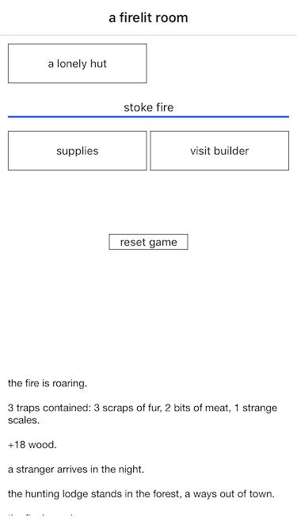
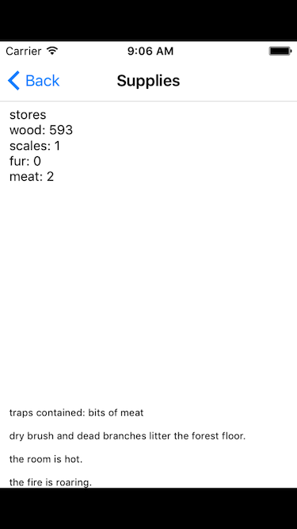
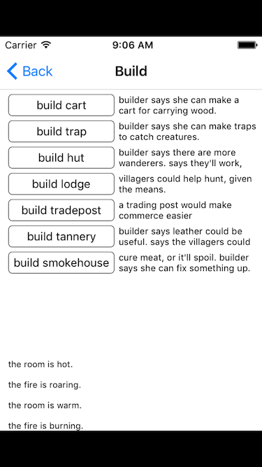
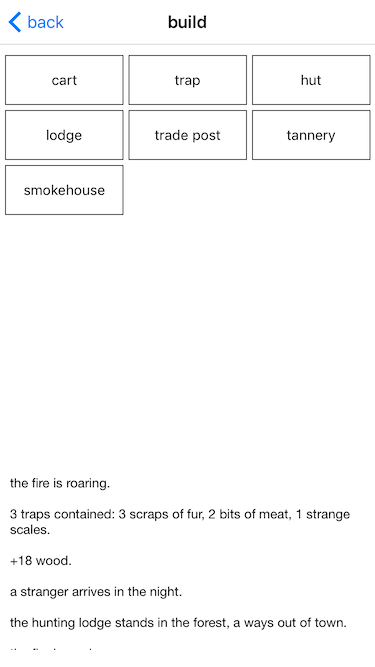
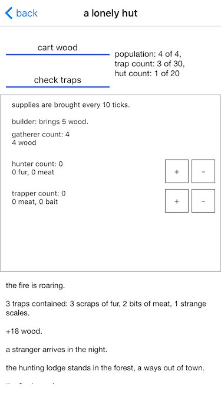
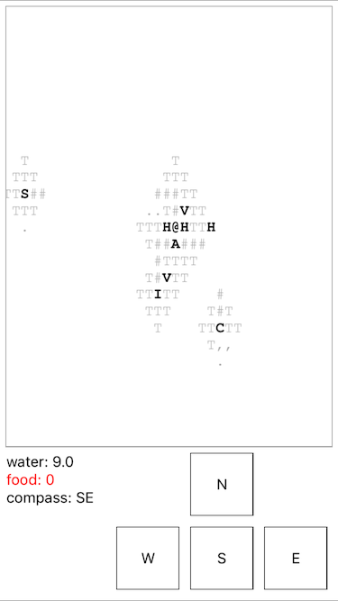

#Building A Dark Room

These are detailed developer logs that I've kept from the beginning of
A Dark Rooms inception though its climb the the number one spot. I
also cover the long tail of games that I released after A Dark
Room. Each developer entry has a short postmortem (along with a
reference to one of the chapters in this book if a deeper dive is needed).

For context (and to avoid major spoilers), it's probably best to actually
play A Dark Room all the way through. I'll put screenshots in here so
that will help, but screenshots can only do the game so much justice
(no different than cliff notes for a book). A Dark Room will take
anywhere from an hour and half to three hours to complete. So, take
the time and do so :-).

Guys and gals, as indie game developers, we're in this together. We
have to support each other (so thank you for buying this book and my
games). If you ever have a question, email me at ar@amirrajan.net.

**Day 1 - Jul 1, 2013: Picking the Development Environment**

Starting off, I knew I didn't want to write an app in Objective C and
XCode again. During my time off, I had already built apps using
Objective C, Interface Builder, and XCode. I _wanted_ the experience
in building an app using the "recommended" development
environment... It was just not fun. I've spent too much time with
bloated IDE's and visual designers. I didn't want to experience that
again.

My first few lines of A Dark Room code were still in Objective C via
XCode. After a day of coding, I got fed up with the environment. I had
a copy of RubyMotion sitting on my virtual shelf. I put aside my fears
of "using something that isn't supported by Apple", dusted it off, and
started building the app in RubyMotion instead.

I coded for 12 hours straight on the game. I haven't had this feeling
in a very long time... losing track of time like that.

**Postmortem**

Picking an environment to work in becomes pretty important. Assuming
you are a one-man/two-man shop, I feel it's important to actually
enjoy what you're working in. XCode and Objective C was not that. When
I started building A Dark Room, Swift wasn't a language that was
available to me. I still wonder if I would have chosen RubyMotion over
Swift (assuming I didn't know much about either at the time). After
all is said and done. RubyMotion has won my heart over. The most
important aspect of choosing a stack to work in is the community. Is
it cohesive? When you ask questions, do you get a response quickly?
And most importantly (for me and I'd expect the main audience for my
book), do they care for the little guy as much as the big development
shop.

If you are on you first game. I'd personally start with a 2D game
engine. Attempting to learn a 3D game engine and all the intricacies
for a complex physics and modeling system is a sure fire way to never
have a game built. You may even want to start with just wrapping a web
page in your app and just use Html and JavaScript. Start small.

**Day 7 - Jul 7, 2013: A Week Later. First Playtest by a "Non-Gamer"**

I got huts working and had implemented population growth. The game was
far from complete. But I took the chance and showed it to a non
gamer. They were thoroughly confused. But slowly got pulled into the
game and had built "a tiny village". I consistently heard "it needs
pictures, it needs visuals". I actually thought about adding black and
white background images to the game that would change as the player
progressed... but I wanted to have a complete game before adding my
own creativity to it.

**Postmortem**

Here is a screenshot of what the game looked like at this point vs
what it looks like today.

Room Screen Before/After

Supplies Screen Before/After

Buy Screen Before/After

Outside Screen Before/After

Aside from adding a bit more symmetry to all the screens (and making
buttons bigger for larger fingers), the general look and feel of the
game stayed the same.  It's incredibly important to stay true to your
style, even when people say otherwise. Generalizing your game
mechanics and trying to appease everyone will just lead to a diluted
experience that won't satisfy anyone. I cover this idea of creating
niche apps in the chapter titled: Making Small, Sustainable Income.

A couple of tips when beta testing:

1. Learn to avoid feedback you don't need (for me it was \"it needs
   pictures\"). Try to understand why they are giving you that
   feedback. Read up on the 5 Whys on Wikipedia. See my chapter
   called: Genin Tsuikyu (Root Cause Analysis) for an interesting bit
   of creative writing.

2. Try to do your beta testing in person. Watch the tester play the
   game. If they do something surprising, ask why they did X vs Y. For
   in person testing, pick a new person every time (having fresh eyes
   on your game is incredibly important).

3. Don't use up all your beta tests all at once. If you release your
   game to all of your beta testers, then you'll probably end up
   getting the same feedback from all of them, and then no subsequent
   feedback when you make updates. So just release the game to one or
   two people at a time, ramping up as you get closer to completion.

**Day 12 - Jul 12, 2013: Road Blocks**

I hit my first road block. When I reached out to Michael about porting
the game to iOS, I actually hadn't finished playing the web version. I
never bought the compass to set out onto the Dusty Path. I thought I
was making extremely good progress, but then I saw the complexity of
the outside world. The economy management part of the game, that I had
been coding on, was just the tip of the iceberg.

The Dusty Path was really hard to fit on a small screen. It took me 10
days to figure out how to approach the next part of the game. I made
tiny sample apps and tried different variations of pinch and zoom
techniques, scrolling techniques, "follow the player" techniques, and
skeuomorphic stuff. Before this day I thought I was so close to
finishing the implementation of game...

**Postmortem**

I still to this day deal with Imposter Syndrome. A Dark Room was an
amazing success, but was it because of my complete redesign or am I
kidding myself and simply standing on the shoulders of a giant
(Michael). My two other games haven't done as well as A Dark Room
(financially). But they are completely my own and both have a near
perfect five star rating. I've been doing this on and off for three
years now and I still feel like I can't get out from under the shadow
of ADR.

A lot of the rework for A Dark Room was getting it to work on a mobile
medium. It was originally a web based idle game that was designed to
be left alone most of the time (not actively played/played in
bursts). I wanted to create an experience that kept you from leaving
your screen until you finished. Try playing the web version of the game
located at
[http://adarkroom.doublespeakgames.com/](http://adarkroom.doublespeakgames.com/)
side by side with the iOS version.

As for building games for mobile read the chapter titled: Build Games
for Mobile.

**Day 21 - Jul 21, 2013: I Want to Stab Cocoa UI In the Face**

I settled on a "follow the player" implementation where the map would
center when the player moved on the map. You could scroll around the
map if you needed, but as soon as you moved again, it would refocus to
your current location. I had to use two layers of overlapping labels
to represent landmarks and terrain (Cocoa UILabels can only have one
format/font). It took 5 days to get the labels lined up and scrolling
correctly. Fifteen days, just gone on trying to display a map.

**Postmortem**

Nothing really to add here that wasn't covered in Day 12. But here is
a screenshot of the Dusty Path as it existed then and now.

**Day 26 - Jul 26, 2013: Making the iOS Version My Own**

At this point I needed to take a break from the Dusty Path and do some
polish and play testing. The pacing in the game was an issue. It was
too slow to get started. I didn't know if it was because I had played
it so many times, or if the game was actually just too slow to get
going on a mobile medium.

I decided to add Friedrich Nietzsche quotes that would show up
randomly when you stoked the fire (to give the player something to
read through the slower points in the game). This didn't make it into
the final release, but were in the game for a while. I had accumulated
200 quotes and felt that it was inline with the atmosphere of the game.

**Day 28 - Jul 28, 2013: Creativity is a Drug**

I don't know what it was about these Nietzsche quotes. I think it was
my first attempt at doing something different and
creative... something that set A Dark Room iOS apart from the web
version. I spent the day incorporating quotes, thinking to myself how
awesome it would be and how eerie it would make the game. Here are
some of them:

>every profound spirit needs a mask: even more, around every profound spirit a mask is continually growing.

>when you stare into the abyss the abyss stares back at you.

>a dictator divides mankind into two classes: tools and enemies.

To help again with pacing, I decided to add "flashes of events" that
would show up when the player gathered wood. It added just enough of a
draw to keep going though the first part. The first message
read:

>hope she's okay, have to keep the fire going.

**Postmortem**

The "flashes of events" was an incredibly important turning point for
the game. It's where I took the world Michael created and put my own
touch of narrative. The "builder" of A Dark Room is by far the most
important component to the narrative. I'd go as far to say that she
_is_ the narrative. I don't think the game would have been as
successful without her and the player's unspoken relationship.

Here are some code metrics for the size of the game at this
point. You'd think a minimalist text based game would be tiny, but
that certainly wasn't the case.

Game Size at Day 28:

- files: 35
- blank: 1048
- comment: 147
- code: 3,584

Final Game Size:

- files: 149
- blank: 3,855
- comment: 291
- code: 16,506

The quotes were in place. I had random Room events working too. The
after effects created from spending so many days with wrestling the
map had worn off. I started specing out the battle sequences
now.

For the business/non technical people reading this, I can't stress
enough how difficult this time period was. It's not fun hitting
roadblock after roadblock. You make some progress, see parts of a
system coming together and then immediately hit another problem. It's
one of the reasons I had to take a step away from the Dusty Path back
in Day 26.

So when your developer friends are in this slog, the last thing they
need to hear is "Why isn't this done yet?", or "I'm surprised this is
taking so long." Try to empathize with the developers, because we've
got enough problems to deal with during these times.

One technique I would recommend is ask the your devs if you can be a
"rubber duck" for them. It's simple to be a rubber duck. Just sit with
them as they code and let them explain to you the lines they are
working on. You don't have to understand anything, just be someone
that asks the naive questions. "What does this part do?". Nod, let
them just talk out loud to you about their reasoning about different
parts of the code base. Just be someone they can talk to out loud
with. That's the best way for you to help the dev team when their in
this kind of situation.

**Day 33 - Aug 2, 2013: Had to Take Another Break**

Development on A Dark Room started to slow down a bit (I hit a bit of
a low point in motivation). Combat was working at a cursory
level... mostly just animations. The battle sequence was pretty much a
real time game with a timer running at 10 frames per second... I was
making a real time game using Cocoa controls as opposed to sprites and
a canvas... kind of felt weird about that. But it worked.

5 days on and off to work through the loot screen (the screen that
came up after you won a battle). Pixel pushing labels and buttons. At
this point I dread any kind of UI work in iOS.

**Postmortem**

For those that are just getting into game development. The explanation
above is important. I was making a game out of buttons, labels, ascii
characters, and progress bars. No crazy 3D engine, hell, not even a 2D
engine. Just stupid controls that you would use to build a business
application. Keep this in mind when you feel this paralyses in
getting started/deciding what to use. Start with a simple idea/game
mechanic and use the most primitive means necessary to get your idea
on a digital medium.

**Day 58 - Aug 25, 2013: Taking a Break to Scratch a NodeJS Itch**

I've spent the last 8 days on the Dusty Path. Adding the Iron Mine,
Coal Mine, Sulfur Mine, working through road creation, and working
through unlocking Workshop items. I needed another break. I spent the
next week working on a Twitter mashup written in NodeJS among other
things. You can find the projects here: [http://amirrajan.net/nodejs-by-example/](http://amirrajan.net/nodejs-by-example/).

**Postmortem**

If you want to make an Html and Javascript game, take a look at
Pixi.js. It's my go to game engine for web games.

Also, August 25th is my birthday... you can buy yourself A Dark Room, The Ensign,
and A Noble Circle as a birthday gift to me :-D

More metrics on A Dark Room.

Game Size at Day 58:

- files: 64
- blank: 1567
- comment: 162
- code: 7,969

Final Game Size:

- files: 149
- blank: 3,855
- comment: 291
- code: 16,506

**Day 108 - Sep 19, 2013: The Slog Continues**

Development of the game continues. Play testing and tweaking the Dusty
Path. I was just a grumpy person this month in general with all the
annoying pixel pushing. I spent some time reflecting on all the
different things I've done on my sabbatical. A Dark Room had been my
primary "work" throughout this time. But I continued to spend time
working with other stacks.

**Postmortem**

Dealing with stress is difficult. Dealing with the ups and downs of
any type of creative work is difficult. You generally feel alone
because no one understands what you are truly going through. And when
you try to explain it to people, you end up feeling belittled. Read
this chapter for a deeper dive into this topic: Dealing With Stress.

**Day 119 - Oct 1, 2013: The Play Testing Grind... This is Not Fun**

All of September went to the Dusty Path (and being a grumpy
developer). I made sure all the different city and town events showed
up. I made sure the workshop items and workers unlocked correctly. I
made sure map state rolled back if the player dies.

I chatted with Michael about this. How the hell he managed to test all
this... He did what I did, just grinded through it. I spent 2 days
creating an automated test suite. It tested all the different random
paths the events could take. Glad I did that. Even with all the manual
testing, I still had a number of bugs.

**Day 137 - Oct 19, 2013: A Dusty Path Complete**

The Dusty Path is finally to a point where all the events work and the
spaceship can be unlocked. I have saving working too. A number of my
friends and family have play tested the game to this point
(and have frankly gotten sick of it).

During this time period I removed the Nietzsche quotes. It just led to
confusion and the pacing was good enough with the "gather wood
storyline events". Reading all those quotes helped shape the storyline
I put in place.

Particularly this quote:

>a dictator divides mankind into two classes: tools and enemies.

There was a specific lull in the gameplay. The time between buying the
compass and then building the Smokehouse, Tannery, and Workshop was
still a bit of a wait. This is where I decided to shift the story to
take a turn for the worse. Through the creation of these three
buildings, the player would slowly see that the villagers were being
overworked. And finally, the villagers became
slaves:

>the villagers...i can see the fatigue in their eyes...

>back breaking labor...the villagers are mine to command...

>leather for finer things, must push the villagers...

>i'll make the villagers work...day and night...they are my slaves...

After the game released, I had a number of people literally reset the
game at this point... or simply stop gathering wood because they
didn't want their villagers to turn into slaves. I didn't expect this
kind of visceral reaction to the events. We murder in video games all
the time. We vandalize. We steal cars. We stomp on the heads of
turtles and mushrooms that never did anything to us. Why did the slave
event cause people to stop playing?

I hate you Michael (in a good way). You didn't build a single
game. You built 3 games and stitched them together in a brilliant
way. The ship scene was the next thing to tackle. There was an end in
sight. The largest part of the game (The Dusty Path) was done.

**Day 141 - Oct 23, 2013: Space Sequence Complete. The Meeting With Michael.**

I couldn't believe it. I had a fully functioning game from beginning
to end. I knew I had a number of things to polish. But the game was
"code complete". Around this time I emailed Michael to set up a video
conference (he lives in Canada.. I live in Dallas, Tx). I can't
believe that all the communication up until this point was done
through email and chat.

Michael hadn't seen the storyline additions I made. I was worried he'd
say "no" to the changes. It wasn't a lot of work to rip it out, but it
was definitely something I felt contributed greatly to the experience
of A Dark Room. It made the player feel anxious, uneasy, even worried
to continue the game at times.

This is a testament to how kind and open to ideas Michael is. He
appreciated the changes I made to the storyline, and loved the
enhancements I made to the mobile version of the game. It was as
simple as that. He just said, "That's awesome! I like it!"

Suffice to say that a huge weight was lifted off of my shoulders. We
got to talking in fact about the intricacies of the game. I mentioned
that most of the game could have been played without any villagers if
iron, coal and sulphur could be mined by the player. Michael said
"Hey, why don't you add that? Add a solo mode with an alternate ending?"

**Postmortem**

If you're going to build a game and try to survive the App
Store. Bring on a partner, even if they play a small role/own only a
small part. You need to have someone to bounce ideas off of and bitch
to. They are the one person that are "in it with you". In retrospect,
it's a good thing that Michael took an active role in the
development. He now handles all the legal and copyright infringement
stuff (so I can concentrate on marketing and the relationship with Apple).

**Day 149 - Oct 31, 2013: My Wife's Final Playtest**

The game is in its final form. My wife sits down and plays the game
for the 50th time. A number of my friends play tested the game. But I
really didn't want to ask too much of them. Most of them only
play tested the game once, at different points in the development
process. I was able to get feedback from them, and they were a
tremendous help (thank you Jason Smith, Eric Sowell, Kevin Wade, Matt
Florence, Tim Rayburn, Zahan Tariq, Christopher Krailo, Aaron
Lasseigne, and Chris Holt).

But my wife stands well above all the others that play tested. She
could have said she was tired of playing this game at any point, but
she didn't. She was the only person that, without hesitation, would
play through the game any time I asked. I handed the final game to her
at 10 pm that night. And she played the game non stop, all the way to
the end. It was 2 am when she completed the play through.
Thank you my dear.

**Postmortem**

Find someone that will play your game to the very end at a drop of a
hat. My wife received that task (she is married to me after all). I'd
bring the game over to her and she played it, no questions
asked... well she grumbled a little bit. But she knew how important it
was to me and obliged. Have people that can support you in building
your games.

**Day 150 - Nov 1, 2013: Submitted to the App Store at $1.99**

I submitted the game to the App Store. The description of the game was
set to "a text based journey... awake. head throbbing. vision blurry."
I still spent a day making minor tweaks to balancing. I play tested the
game another 4 times before releasing. My game times were pretty damn
fast at this point because I knew exactly what to do. I could beat the
game in 90 to 100 minutes without even thinking too hard. Now I just
have to wait. This was a good week. I shipped A Dark Room for iOS. And
I was now preparing for a NodeJS competition: Node Knockout 2013!

**Postmortem**

For Node Knockout 2013, I teamed up with three other devs and coded
for a weekend straight on a Div Kick clone. We used Html/Javascript
and Canvas controls. You can check out the fruits of our labor at
[http://github.com/amirrajan/node-kick](http://github.com/amirrajan/node-kick).

**Day 157 - Nov 8, 2013: One of the Worst Days of My Life**

It took a full 7 days. But A Dark Room was finally in the App Store. I
downloaded the release version of the game on my iPhone 5 and was able
to play it. It was an unreal feeling given how much work was put in. I
know Michael tweeted about the release. I was hoping that many people
would tweet about the iOS version. It was 6 months since the Hacker
News post of A Dark Room. Everyone who upvoted the game probably have
forgotten about it by now. But maybe it would go viral like the web
version did.

The first reply to Michael's tweet came in. I was sick to my stomach:
"The game just crashes, I have an iPhone 5s". I screamed at the top of
my lungs, broke down, literally fell to my knees and cried. No one
wants to see that on their release day. No one should ever have that
happen to them. I tried my wife's iPhone 5s and it was crashing there
too. I texted my friend Eric Sowell and the game was also crashing for
him. At that moment I wished I never spent all that time building it.

I pulled myself together and put a debug build of A Dark Room on my
wife's iPhone. It crashed immediately with a runtime exception (the
error itself is a blur now, but I remember it having to do with
compilation flags). My assumption at this point was it had something
to do with 64 bit architecture of the new iOS devices.

I drove (sped) to the Apple Store in the Parks at Willow Bend Mall,
and bought an iPad Air to test out my theory. I sat at the food court,
took the iPad out. I loaded up the developer certs and deployed a
debug build of the app. It crashed there too. I ended up explicitly
setting the compilation flag to armv7 for all libraries
I was referencing. This fixed the debug build.

I repackaged the app and via iTunes Connect, requested an emergency
release of the app. Apple got back to me and approved the emergency
release. I pushed up version 1.1 of the app. Then I just had to
wait... nothing really I could do. I was taking part in a NodeJS
competition at the time. So that helped keep my mind off of it.

**Postmortem**

For all that is good in the world. Do a beta build of your game
distributed through iTunesConnect/Test Flight. Doing this would have
saved me from this terrible, terrible day. Before every release, I
make sure to do a beta release of your game, you need to deploy a
version with `beta-reports-active`. This will allow you to test your
game in it's "release" state, on a device that isn't a developer
device. Do this or risk living through the same thing I did.

Also, watch the Indie Game: The Movie on Netflix. It's a great look at
some of the struggles indie game devs go through (hits really close to
home, especially after this day one crash).

**Day 158 - Nov 9, 2013: The Crash Fix Shipped**

Over the weekend (during the NodeJS competition), I received an email
saying that version 1.1 of A Dark Room was ready for sale. That
moment, I asked Eric (he was also in the competition) to download the
updated version of the app. He started it up, and it worked.

I still have no idea why setting the compilation flag to armv7
worked. But I'm not about to change that now. To this day, it's still
extremely stressful deploying to the App Store. I have no idea if the
instant crash will come back. I can't recreate it using the simulators
either.

Our Node Knockout 2013 team: Team Us - As in "us" not "them", ended up
placing 15th overall and placed 6th in the fun/utility category.
Awesome experience.

**If You Build It, They Will Come is a Complete Utter Lie**

For all the asspiring game developers out there. The sad reality is
that building your amazing game isn't enough. You then have to spend
an immense amount of time telling people about it. The next chapter
shows this slog.
