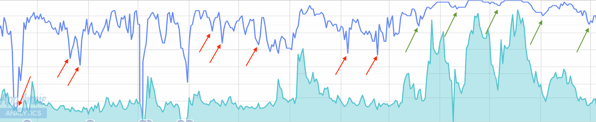

# The In's And Out's of the Review and Ranking System

Here is what I've learned about how apps get ranked in the App
Store. I'm sure some of this isn't perfect, but this is what I've
observed after obsessively watching A Dark Room's rank rise and fall
over 2 years.

### Downloads Over a Four to Five Day Moving Average Dictate Rank

The ranking system bumps the rank of apps that have consistent
download numbers over a "long" period of time. Having a huge spike,
followed by nothing, will temporarily bump your app a few spots for a
few hours... but that's really it.

### You Need a 8k to 10k Downloads a Day to Hit The #1 (Premium) Spot in the US

To hit the number one spot in the premium App Store, you need a
sustained 8 to 10k downloads a day (the moving average is
important). Once you're at that spot, D-day will get you _20,000 downloads_.

Here are relative App Store sizes for other countries (the list shows
the number of downloads needed to reach various spots).

- United States: Top #100 apps: 1k DL's, Top #10 apps: 5k DL's, #1 app: 10k DL's
- Canada: Top #10: 500 DL's, #1 app: 1k DL's
- United Kingdom: Top #100 apps: 100 DL's, Top #10 apps: 1k downloads, #1 app: 5k downloads
- Australia: Top #10 apps: 200 downloads, #1 app: 700 downloads
- New Zealand: #1 app: 200 downloads
- Singapore: #1 app: 80 downloads
- Germany: #1 app: 1k downloads
- South Africa: #1 app: 15 downloads
- India: #1 app: 15 downloads

Some things worth noting about rankings across countries:

- The ranking systems are completely independent. Being #1 in one
  country doesn't have any direct impact on another countries rank.
- Going viral in the UK does indirectly impact going viral in the US.
- Going viral in the US does indirectly impact going viral in Canada.
- Going viral in AUS does indirectly impact going viral in New Zealand
  and Singapore.

The number of downloads to reach the top of your category varies based
on category.

For example, it takes A Dark Room ~500 downloads to stay at the #1
spot in the RPG category, but only gives me the #8 spot in the
Adventure category.

It takes A Noble Circle ~40 downloads to stay in the top 10 of the
Music category (and doesn't even rank in the top 150 RPG category... usually).

The Ensign (the pre-sequel to A Dark Room) hovers around the top 50
RPG's at 50 downloads a day.

### You Need 100,000 downloads to reach the #1 (Free) Spot in the US

Generally speaking you need 10x the number of downloads to reach the
same ranks in the free App Store. When A Dark Room was the #3 free iOS
App (out ranked by Facebook's Messenger and Crazy Taxi), it got
a _quarter of a million downloads on D-day_ (I kept it free for only one
week, since I don't have ads or IAP... just wanted to spread the word
about the game).

### How Much Does Minecraft Make?

Given this information (and the fact that Minecraft is pretty much
the number one iOS game year round), I can project what they make on
sales, assuming the following:

- Price Point: 6.99
- Downloads Per Day: 8k to 10k (we'll go with the low end)
- Time At #1 Spot: 365 days

Daily Revenue (conservative): $55,920
Yearly Revenue (conservative): $20,410,800

### Heads Up! Gets Special Treatment

Alright, just throwing this out there. But after three years of
watching the App Store, I've come to the conclusion that Heads Up (the
app created by Warner Bros and endorsed by Ellen Degeneres) gets
special treatment in rankings.

Let's look at the lifetime reviews for games surrounding Heads Up:

- Number 1 Spot: Minecraft: 451,612
- Number 3 Spot: Plague Inc.: 138,970
- Number 4 Spot: Geometry Dash: 224,832
- Number 5 Spot: Bloons TD 5: 39,868

And what are the review numbers for Heads Up? _6,977_. Why has Heads
Up! stayed at the #2 spot for so long? Maybe the following:

### Lifetime Rank (and age of app) Influences Immediate Rank

One thing that does influence your current rank is how long your game
has been out, and what rank it's held during that time period. There
is a "reset" that occurs in the App Store. I've observed this
happening (at least) once every quarter. For one day, it looks like app ranks are
"reset" to the lifetime average for a given app. There have been
numerous times where ADR has slipped down to the #50 spot in the RPG
category, and then the next day it's at #5... without any increase in
downloads. And of course, when you are "above the fold", your
downloads organically increase (thus solidifying your spot). This is
probably what has happened to Heads Up... though I doubt it.

### A Bit More Analysis on How Lifetime Rank Influences Current Rank

There is a very strong corellation between rank vs downloads. But
there are points of drops - and lack there of - too. Here is graph of
downloads (teal solid color) vs rank (blue line). You'll see points
where my rank dropped even though my sales were steady (red arrows),
and also where my rank _didn't_ drop, when sales were falling (green
arrows). Aside from download numbers, there seems to be another
component in play that affects rank. I believe that this component is
what keeps games like Heads Up! at the rank it currently holds.

### Review System

Here is what I've learned about the review system.

- Reviews sell games. Keep your review count high (hell, even make
  your app free after a release to get an influx of new users and reviews).
- People who are given a promotion code will not have their review registered.
- Whenever you do a new release of your app, the current reviews that
  your app has, get archived. You can use this knowledge to sweep bad
  reviews under the rug.
- Five star reviews show up at the top, but can come after four star
  reviews _if_ the four star review is longer.

Here is the top five star review for ADR (all time):

>With all the mindless apps out there now like Clash of Clans and
>Candy Crush, this app lives in a perfect environment to set itself
>apart, and that it does. While I don't want to ruin anything, I can
>firmly say that anyone who has the will to finish the story will be
>humbled.  The game forces us to reflect on the worst aspects of our
>individual pasts, and our pasts as a race.  Not only does this game
>keep you striving to play more, and cart just one more stack of wood
>(as it is supposed to), but the darker commentary at play behind the
>scenes suggests it's not only the room that's dark, but much much
>more. There is sound reason for the developers only showing one
>picture in the app descrition and the very short commentary, and once
>you play and experience the game, you too will understand why. This is
>by far the most powerful app I have seen, and possibly the most
>impactful game across all consoles I've seen. I really hope this
>review helps your decision to get the game, and that you can reflect.
>
>I have two caution points for anyone willing to buy the game. The
>first is it requires patience, a lot of patience. Even though the game
>is 9+, I'd personally think you will only experience this to the
>fullest if you are 14 bare minimum. Second point I need to make is
>that you have to realize this game is different. It's not a shoot me up
>with graphics and fancy animations, it's a seemingly basic storyline
>with deeper and darker meanings behind it.

The review clocks in at approximately 280 words.

Here is the _first_ four star review that is _above_ a (shorter) five
star review:

>This game is getting huge accolades, and since they're well deserved,
>I won't repeat them here other than to say everyone should play this
>and experience it once.
>
>However, I find the premise of the suggested second play through
>irritating. Spoiler alert: [25 words ommitted because of spoilers].
>However, it bothers me that there was no way to balance the work so
>that the people who are using huts could do moderate work
>for their provisions and not [25 words ommitted because of spoilers].
>
>Instead, we get a staggeringly long grind for fur in order to
>purchase one's own items, while farming to produce items, despite
>sitting on mounds of wood. Once you die searching for precious
>leather, steel, and weapons, it's yet another staggering grind to
>replace the items you lost upon death. It's challenging, but annoying,
>especially when one rejects the idea that [20 words committed because of spoilers].

The four star review clocks in at approximately 228 words.

There are actually longer five star reviews of the games, but it seems like
there is a top end to the word count (at which point the really really
long reviews are discarded).

**Here is how I've used this information.** Let reviews come in as they
organically should. Then once you have enough good reviews, leave a
review for your own app that is longer than the longest five star
review, _but echoes what all the reviews below say_. By doing
this, you give the customer a positive first impression about your app
(that is repeated by the second, third, and fourth review).

### Holidays Sell Apps

Here are some number for ADR before and on a Holiday:

- November 10, 2015: 161
- November 26, 2015: 232
- December 23, 2015: 166
- December 24, 2015: 164
- December 25, 2015: 286
- December 26, 2015: 325
- Week Before Spring Break 2016: ~400 Dl's a Day
- Week of Spring Break 2016: ~900 Dl's a Day

So, don't put your app on sale during holidays. Put your apps on sale
when you are falling in rank (make your app free even). There are
sydications out there that scrape the App Store for "apps gone on
sale/free"... the syndications get referral money if someone buys an app
using their referral link. So, you'll get some free press from that.
